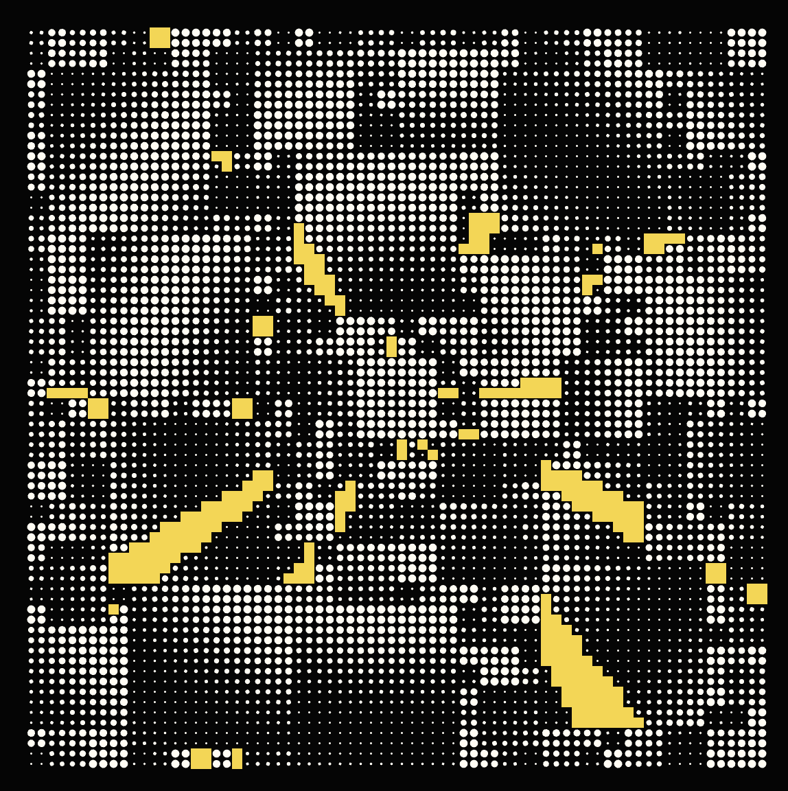
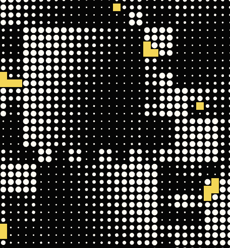

# Quiz 8

###### mber0305_9103_tut5

## Imaging Technique Inspiration

>  **The Space in which to Place Me by Jeffrey Gibson**

*Biennale di Venezia 2024 (American pavilion)*


*Exterior view of ‘the space in which to place me’ (2024)*


```
The pavilion is a dialogue between the senses, a layering of cultural references highlighted by the use of different techniques: painting, ceramic, fabric, beads and text.
```


*Interior arworks*

In the project I would like to incorporate different things of the artwor: 

- The use and combination of pop and lively colors
- An hybrid visual language
- Multiple levels
- Modernist geometric shapes and abstractions, but also of text, which change and evolve over time.
- Through textures, recreate the use of different materials.

*The goal is to create a surprising, dramatic and dynamic work that tells a story.*


<br>
<br>

## Coding Technique Exploration

>  **Wednesday morning by Roni Kaufman**

*OpenProcessing sketch*



[click to see more info](https://openprocessing.org/sketch/2225336)

This coding technique could help me in several ways:

- The sequence of equal shapes of different sizes, and their movement, could be used to **recreate the different density** of the materials and refer to different textures.

- The arrangement of the elements on the canvas so as to combine very different shapes and sizes could help me **convey the idea of ​​depth** so as to be able to structure the work on multiple levels. <br><br>



```
To achieve other objectives such as the use of a hybrid visual language, some graphic elements could be replaced with text or simply characters.
```
