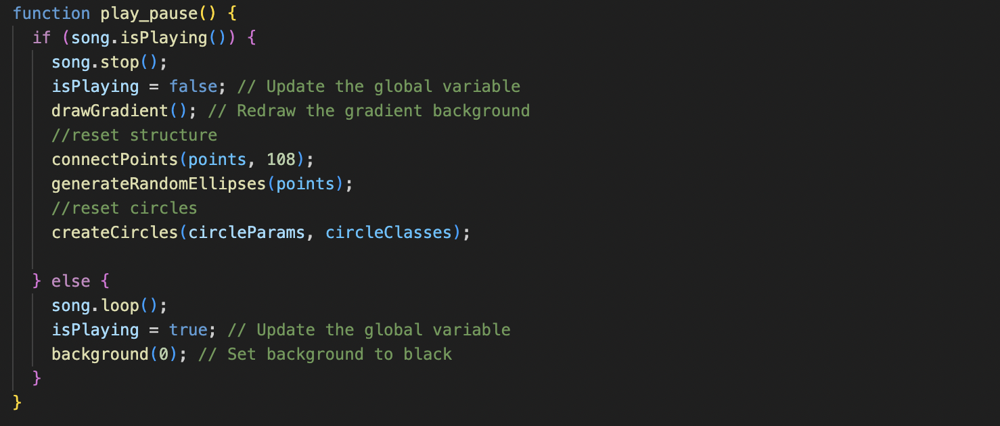

# Major Project 
##### Group E - Individual part
###### Maya Bernacchia - mber0305

## References

>  **The Space in which to Place Me by Jeffrey Gibson**

*Biennale di Venezia 2024 (American pavilion)*


*Exterior view of ‘the space in which to place me’ (2024)*


```
The pavilion is a dialogue between the senses, a layering of cultural references highlighted by the use of different techniques: painting, ceramic, fabric, beads and text.
```


*Interior arworks*

In the project I would like to incorporate different things of the artwor: 

- The use and combination of pop and lively colors
- An hybrid visual language
- Multiple levels
- Modernist geometric shapes and abstractions, but also of text, which change and evolve over time.
- Through textures, recreate the use of different materials.

*The goal is to create a surprising, dramatic and dynamic work that tells a story.*


<br>
<br>

## Coding Technique Exploration

>  **Wednesday morning by Roni Kaufman**

*OpenProcessing sketch*


[click to see more info](https://openprocessing.org/sketch/2225336)

This coding technique could help me in several ways:

- The sequence of equal shapes of different sizes, and their movement, could be used to **recreate the different density** of the materials and refer to different textures.

- The arrangement of the elements on the canvas so as to combine very different shapes and sizes could help me **convey the idea of ​​depth** so as to be able to structure the work on multiple levels. <br><br>


```
To achieve other objectives such as the use of a hybrid visual language, some graphic elements could be replaced with text or simply characters.
```
<br>
<br>

>  **Synesthesia by Alida Sun**


[click to see more info](https://https://www.youtube.com/watch?v=ZATrHLFy8qw&t=5s)

An interactive audiovisual hand coded in C++

The artwork inspired me to create an engaging experience through music, aiming for a visually chaotic yet captivating effect that resembles club lights—vibrant, disordered, and immersive. At the same time, the visuals maintain an underlying order and structure, balancing energy with organization.

## Details of animation

The animation is driven by the audio track’s amplitude, which is mapped to animate properties like stroke size and color. To emphasize the animation, the hexagonal structure fades out as the music starts, and the background shifts to black, making the color combinations and movements stand out vividly.

> Instructions


Press the play/pause button to start the music and watch the artwork come to life before your eyes. Click the button again to return to the original view and enjoy the static composition.

<br>
<br>

## Technical explanation

> setup() Function


The setup() function initializes the canvas and graphical elements. It creates a 500x500 pixel canvas and calls functions to draw a gradient background (drawGradient()) and create circle objects with given parameters (createCircles) and the structure using connectPoints() and generateRandomEllipses().

For sound, an amplitude analyzer (analyser) is created using new p5.Amplitude(), allowing the program to capture and analyze the audio volume level from the input song. Finally, a "Play / Pause" button is created, styled, and positioned on the canvas. When clicked, it triggers the play_pause function to control the audio playback.

<br>

> draw() Function


The draw() function is responsible for the animation. It begins by displaying all circle objects in the circles array using each object’s display() method. Next, it captures the current audio volume level from the analyser and maps this value to control the thickness of the circle strokes (strokeThickness) and the size of the dots (dotSize).

When the music is playing (isPlaying is true), the function iterates through each circle in the circles array and applies changes based on the circle’s type:

- LineCircle: Adjusts the strokeSize based on the mapped volume, dynamically changing the circle outline thickness.

- SmallCircle: Randomly changes the color of the smallCircleColor.
- ZigzagCircle: Sets the strokeColor based on the current volume, creating a grayscale effect that responds to the volume level.

<br>

```
Together, these functions use the audio volume to animate visual properties dynamically, creating a sound-responsive visual experience.
```
<br>

> play_pause() Function



It controls the playback of the music and the corresponding visual changes:

- **When Music is Playing:** If the song is playing, it stops playback, sets isPlaying to false, redraws the gradient background, resets the structure with connectPoints and generateRandomEllipses, and recreates the circles with createCircles().

- **When Music is Paused:** If the song is paused, it starts playback in a loop, sets isPlaying to true, and changes the background to black, highlighting the animation synced to the audio.

<br>

```
This function toggles between static and dynamic visuals based on the audio state, creating an interactive audio-visual experience.
```

<br>

## References

- .isPlaying() https://p5js.org/reference/p5.SoundFile/isPlaying/

 I used .isPlaying() to check if the song is currently playing. This function returns true if the song is playing and false otherwise.

- .stop() : https://editor.p5js.org/aferriss/sketches/SyQ4OFAa-

I used .stop() to stop the song and reset it to the beginning. When the song is stopped, I also triggered other actions, such as redrawing the background, resetting the graphical structure, and creating new circles.

- .loop() : https://p5js.org/reference/p5.MediaElement/loop/

I used .loop() to start the song and play it in a continuous loop, so that the song keeps playing until manually stopped.

- drawGradient():  https://www.youtube.com/watch?v=DJgDW3F68Xc and https://p5js.org/reference/p5/lerpColor/

I used lerpColor() to calculate the intermediate color between two specified colors, based on a value ranging from 0 to 1. The function takes three arguments: the starting color, the ending color, and the interpolation value (inter), which determines how close the resulting color is to the final color. An inter value of 0 will return the first color, while an inter value of 1 will return the second color. In this case, the interpolation happens linearly, creating a gradual transition from dark blue to light blue, based on the vertical position of the pixel.

<br>

> AI use

- createCircles Function

PROMPT CHATGPT:

" let circleParams = {
  1: [
    ['DotCircle', 65, 70, 140, 75, 5, '#272b5f', '#bfe0f0'],
    ['LineCircle', 65, 70, 40, 4, 3, '#984e90', '#006c31'],
    ['SmallCircle', 65, 70, 3, '#040506', '#05844d', '#b1a4b4']
  ],
  2: [
    ['DotCircle', 175, 180, 140, 75, 5, '#159439', '#e3f2ef'],
    ['LineCircle', 175, 180, 40, 4, 3, '#eb5559', '#c74d97'],
    ['SmallCircle', 175, 180, 3, '#040506', '#05844d', '#b1a4b4']
  ],
....
}


Once the parameters of the circles are defined within the dictionary, the idea is to create a function that iterates through the dictionary and creates the circles on the canvas. circleParams is an object that contains different keys (1, 2, 3, etc.), each representing a set of parameters to create various types of circles on the screen. Each key is associated with an array of arrays, where each subgroup defines a class and the parameters required by the class to create the circle instance. AI was used to understand how to access the various parameters.

The idea is to create a loop that iterates over the keys within the circleParams object, and for each key, an array of parameters  is extracted, containing the data for a group of circles. Inside each parameter array, the code iterates through each element: the first is the class, and the rest are the parameters.

The function then looks for the corresponding class in the classes dictionary. If a class associated with that type exists, a new instance of that class is created by passing the remaining parameters (all except the first one, which is the class type).

Based on that help me to write a function"
